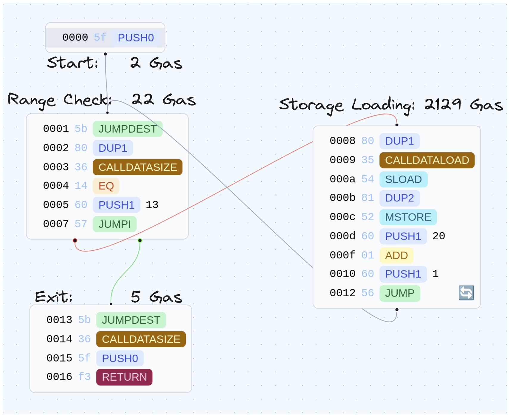
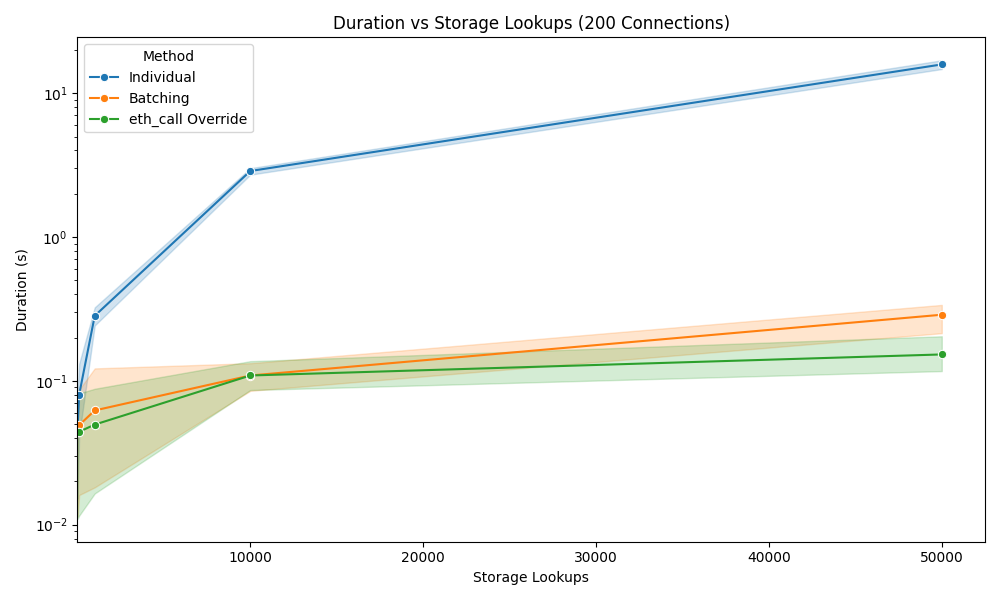
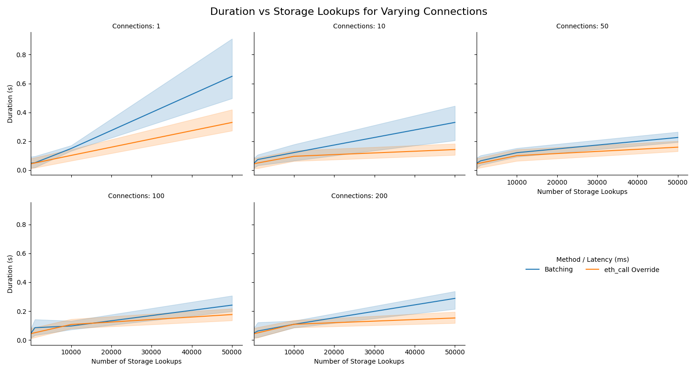

# Bulk Storage Extraction

Most Dapp developers have heard of and probably use the excellent [Multicall](https://github.com/mds1/multicall) contract to bundle their `eth_call`s and reduce latency for bulk ETL in their applications (we do too, we even have a python library for it: [Manifold](https://github.com/Dedaub/manifold)).

Unfortunately, we cannot use this same trick when getting storage slots, as we discovered when developing our [storage explorer](https://app.dedaub.com), forcing developers to issue an `eth_getStorageAt` for each slot they want to query. Luckily, Geth has a trick up its sleeve, the “State Override Set”, which, with a little ingenuity, we can leverage to get bulk storage extraction.

## Geth Trickery

The “state-override set” parameter of Geth's [eth_call](https://geth.ethereum.org/docs/interacting-with-geth/rpc/ns-eth#eth-call) implementation is a powerful but not very well-known feature. (The feature is also present in other Geth-based nodes, which form the base infrastructure for most EVM chains!) This feature enables transaction simulation over a modified blockchain state without any need for a local fork or other machinery! 

Using this, we can change the balance or nonce for any address, as well set the storage or the code for any contract. The latter modification is the important one here, as it allows us to replace the code at an address we want to query the storage for with our own contract that implements arbitrary storage lookups.

Here is the detailed structure of state-override set entries:

|FIELD|TYPE|BYTES|OPTIONAL|DESCRIPTION|
|---|---|---|---|---|
|balance|Quantity|<32|Yes|Fake balance to set for the account before executing the call.|
|nonce|Quantity|<8|Yes|Fake nonce to set for the account before executing the call.|
|code|Binary|any|Yes|Fake EVM bytecode to inject into the account before executing the call.|
|state|Object|any|Yes|Fake key-value mapping to override **all** slots in the account storage before executing the call.|
|stateDiff|Object|any|Yes|Fake key-value mapping to override **individual** slots in the account storage before executing the call.|


## Contract Optimizoor

The following handwritten smart contract has been optimized to maximize the number of storage slots we can read in a given transaction. Before diving into the results I'd like to take an aside to dive into this contract as it's a good example of an optimized single-use contract, with some clever (or at least we think so) shortcuts.

```
[00] PUSH0              # [0], initial loop counter is 0  
[01] JUMPDEST  
[02] DUP1               # [loop_counter, loop_counter]  
[03] CALLDATASIZE       # [size, loop_counter, loop_counter]  
[04] EQ                 # [bool, loop_counter]  
[05] PUSH1 0x13         # [0x13, bool, loop_counter]  
[07] JUMPI              # [loop_counter]  
[08] DUP1               # [loop_counter, loop_counter]  
[09] CALLDATALOAD       # [<slot>, loop_counter]  
[0a] SLOAD              # [<x>, loop_counter]  
[0b] DUP2               # [loop_counter, <x>, loop_counter]  
[0c] MSTORE             # [loop_counter]  
[0d] PUSH1 0x20         # [0x20, loop_counter]  
[0f] ADD                # [loop_counter] we added 32 to it, to move 1 word  
[10] PUSH1 0x1          # [0x1, loop_counter]  
[12] JUMP               # [loop_counter]  
[13] JUMPDEST  
[14] CALLDATASIZE       # [size]  
[15] PUSH0              # [0, size]  
[16] RETURN             # []
```

To better understand what's going on we can take a look at the high level code (this was actually generated by our [decompiler](https://app.dedaub.com/decompile?md5=977d622e1886ea97954a053b33ee0138))

```solidity
function function_selector() public payable {

    v0 = v1 = 0;

    while (msg.data.length != v0) {
        MEM[v0] = STORAGE[msg.data[v0]];
        v0 += 32;
    }

    return MEM[0: msg.data.length];
}
```

Walking through the code we can see that we loop through the `calldata`, reading each word, looking up the corresponding storage location, and writing the result into memory. 

The main optimizations are:
- removing the need for a dispatch function
- re-using the loop counter to track the memory position for writing results
- removing abi-encoding by assuming that the input is a contiguous array of words (32-byte elements) and using  `calldatalength` to calculate the number of elements

If you think you can write a shorter or more optimized bytecode please submit a PR to [storage-extractor](https://github.com/Dedaub/storage-extractor) and @ us on [twitter](https://twitter.com/dedaub).

## Results

### Theoretical Results

To calculate the maximum number of storage slots we can extract we need three equations, the execution cost (calculated as the constant cost plus the cost per iteration), the memory expansion cost ($x * 3 + (\frac{x^2}{512})$) and the calldata cost.

We can break down the cost of the execution as follows:
- The start, the range check and the exit will always run at least once 
- Each storage location will result in 1 range check and 1 lookup



Calculating the calldata cost is slighly more complex as its variably-priced: empty (zero-byte) calldata is priced at 4 gas per byte and non-zero calldata is priced at 16 gas. Therefore we need to calculate a placeholder for the average price of a word (32-bytes). 


```python
zero_byte_gas = 4
non_zero_byte_gas = 16

# We calculate this as the probability each bit of a byte is a 0
prob_rand_byte_is_zero = (0.5**8) # 0.00390625
prob_rand_byte_non_zero = 1 - prob_rand_byte_is_zero # 0.99609375

avg_cost_byte = (non_zero_byte_gas * prob_rand_byte_non_zero) + \
				(zero_byte_gas * prob_rand_byte_is_zero) # (16 * 0.99609375) + (04 * .00390625) = 15.953125
```

Therefore the average word costs:  $15.953125 \times 32 \times x$

We can combine all of these equations and solve for the gas limit to get the maximum number of storage slots that can be read in one call.

$$
\begin{align*}
(24 + ((2129 + 22) \times x) + 5) + (15.953125 \times 32 \times x) + ((x \times 3) + (\frac{x^2}{512})) &= 50000000 \\
\frac{x^2}{512} + 2664.5x + 29 &= 50000000 \\
x &\approx 18514
\end{align*}
$$

Therefore given a 50 million gas limit (which is the [default for Geth](https://github.com/ethereum/go-ethereum/blob/253447a4f5e5f7f65c0605d490360bb58fb5f8e0/eth/ethconfig/config.go#L66)) we can read an average of 18514 slots.

This number will change based on the actual storage slots being accessed, with most users being able to access more. This is due to the fact that most storage variables are in the initial slots of the contract, with only mapping and dynamic arrays being pushed to random slots (or people using advanced storage layouts such as those used in Diamond proxies).

### Practical Results

To show the impact of this approach we wrote a python script which queries a number of storage slots, , first using normal RPC requests and batched RPC requests for the normal `eth_getStorageAt`, and then comparing to the optimized `eth_call` with state-override set. All the testing code can be found in the [storage-extractor](https://github.com/Dedaub/storage-extractor) repo, along with the bytecode and results. 

To isolate variable latency as a concern, we ran the tests on the same machine as our node, with latency being re-added by utilizing `asyncio.sleep` to have a controlled testing environment. To properly understand the results, lets look at the best-case scenario of 200 concurrent connections.



In order to properly represent the three methods we need to set the y-axis to be logarithmic since standard parallel `eth_getStorageAt`s are too slow. As you can see even with 200 connections standard RPC calls are 57 times slower than RPC batching and 103 times slower than `eth_call` with state-override.

We can take a closer look at the difference between batching and call overrides in the next graph. As you can see, call overrides are faster in all scenarios since they require fewer connections, this is most noticeable with the graph in the top left which highlights the impact of latency on the overall duration.



## Conclusion

To wrap up this blog post, I'd like to thank the Geth developers for all the hard work they've been doing, and the extra thought they put into their RPC to enable us to do funky stuff like this to maximize the performance of our applications.

If you have a cool use of the state-override set please tweet us, and, if you'd like to collaborate, you can submit a PR on the acompanying github repo ([storage-extractor](https://github.com/Dedaub/storage-extractor)).
